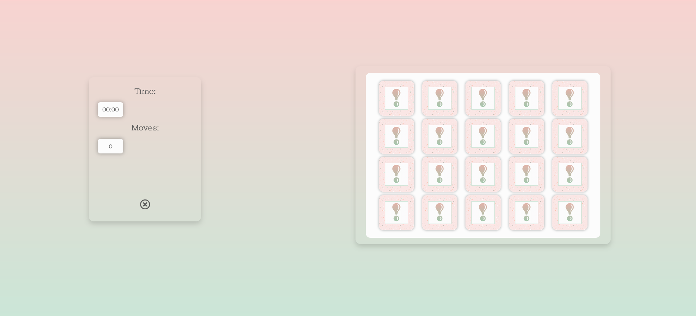

# Testing

## Code validators

[HTML Validator](https://validator.w3.org/) : 

- Home Page

The first test returned an error repeated 3 times. This was solved by removing the <button> element and adding a 
 instead. I also created .btn and .btn-link classes to fix the styling.
The same issue was found in the instructions.html and vocabulary.html files and was solved the same way.

- Instructions Page

- Refresh Vocabulary Page

- Game Page

[CSS Validator](https://jigsaw.w3.org/css-validator/) : the test returned some warnings related to some browser cross-compatibility. They were ignored in order to have the content render properly on every browser.

[JSHint](https://jigsaw.w3.org/css-validator/) : 

## Responsiveness

To test the responsiveness of the site I used [Chrome DevTools](https://developers.google.com/web/tools/chrome-devtools) and [Responsive Design Checker](https://www.responsivedesignchecker.com/).

## Browser compatibility

Notes:

- Firefox:

There two minor issues on this browser. In general, the font-size appears to be smaller than seen on the other browsers, but it's still readable. 
Another small issue is the time and moves counter in the game page not being centered.

- Internet Explorer:

There are some styling issues when using IE. The effect text gradient I implemented for the headings don't really work as expected. 
Other minor issues include the background color of the buttons that is supposed to be semi-transparent or the time and moves counter in the game page that are not centered (as seen on the example above on Firefox as well).

The website renders properly on IE but when you click on play, you can see an empty grid with no cards making the game unplayable on this browser.

## Testing User stories

- As a user, I’d like to have fun while playing an easy game.
- As a user, I’d like a game that has simple but nice visuals, with easy recognisable pictures.
- As a user playing for the first time, I'd the game structure to be obvious so I can start playing right away.
- As a user that doesn’t know how the game works, I'd like to be able to find the instructions easily.
- As a competitive user, I’d like to know in how much time I completed the game.

###### Didactic Goals
- As a teacher, I’d like a game where my students can learn while having fun.
- As a teacher, I'd like a challenging game that my students will want to play at home for fun and learn new words in the process.
- As a student, I’d like to test the new vocabulary I learn in Spanish class while having fun in the process.
-

- As an owner, I want to show off what we can do to attract more clients.
  - When the user is navigating the site, they'll see restaurant's images at the top of every page.
  - On the **Menu Page** the user can see all the dishes the restaurant offers with pricing information.

- A
## Bugs 

[Go back to README.md file](README.md).