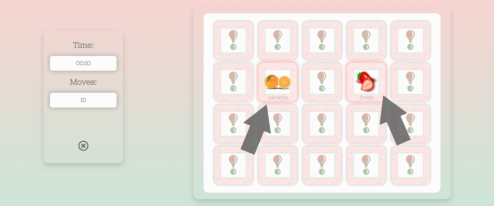

# Testing

## Code validators

[HTML Validator](https://validator.w3.org/) : 

- Home Page

The first test returned an error repeated 3 times. This was solved by removing the <button> element and adding a 
 instead. I also created .btn and .btn-link classes to fix the styling.
The same issue was found in the instructions.html and vocabulary.html files and was solved the same way.

- Instructions Page

- Refresh Vocabulary Page

- Game Page

[CSS Validator](https://jigsaw.w3.org/css-validator/) : 

The test returned some warnings related to some browser cross-compatibility. They were ignored in order to have the content render properly on every browser.

[JSHint](https://jigsaw.w3.org/css-validator/) : 

does not affect the integrity of the game state.

## Responsiveness

To test the responsiveness of the site I used [Chrome DevTools](https://developers.google.com/web/tools/chrome-devtools) and [Responsive Design Checker](https://www.responsivedesignchecker.com/).
I also asked some family members and friends to test it on their devices.

Notes:

The game doesn't work properly on landscape mode on small devices. Although it is still playable, it might be a bit uncomfortable and not ideal to play and having to scroll down to see the cards. 
In this mode, the time and moves counter is usually hidden due to overflow.

---

## Browser compatibility

Notes:

- Firefox:

The only small issue found in this browser is that, in general, the font-size appears to be smaller than seen on the other browsers, but it's still readable. 

- Internet Explorer:

There are some styling issues when using IE. The effect text gradient I implemented for the headings doesn't really work as expected. 
Other minor issues include the background color of the buttons that is supposed to be semi-transparent or the time and moves counter in the game page that are not properly centered.

The website renders properly on IE but when you click on play, you can see an empty grid with no cards making the game unplayable on this browser.

---

## Testing User stories

- As a user, I’d like a game that has simple but nice visuals, with easy recognisable pictures.
  - The game has a simple but clean design. The pictures used for the game cards are very intuitive and consistent through the game itself and the **Refresh Vocabulary** page, to avoid any misunderstandings.

- As a user playing for the first time, I'd like the game structure to be obvious so I can start playing right away.
  - Right in the first page, just under the name/logo, it says memory game, which is obvious to most people. For those who haven't played a memory game before, the **Instructions** page is easy accessible from the **Home** page too. 

- As a user that doesn’t know how the game works, I'd like to be able to find the instructions easily, and when reading them, to be clear and concise.
  - As seen on the picture above, the instructions are very easy to find in the home menu. When clicking on them, we can see a brief explanation of how the game works and two links to start playing or to refresh the vocabulary the user is about to encounter in the game first.

- As a competitive user, I’d like to know how much time I needed to complete the game and how many moves I needed.
  - There is a time counter and a move counter in the **Game** page. In addition, there is a game over modal when the user finishes the game that shows in how much time and in how many moves the game was completed.

- As a teacher, I'd like a challenging game that my students will want to play at home for fun and learn new words in the process.
  - The game is designed to be as addictive as any other memory game, with every card providing three pieces of information at the same time.
  The image will help them recognise immediately what the fruit is, the text will tell them the name in Spanish, and the audio clip will provide the word's pronunciation. 
  - All this with the addition of the repetition factor does certainly improve the learning experience. This can be found both in the game and in the **Refresh Vocabulary** page. 

- As a student, I’d like to test the new vocabulary I learn in Spanish class while having fun in the process.
  - Students can play the game as many times as desired until they learn all the words or until they get tired. They can also get their time and moves and compare with other classmates for a bit of competitiveness.
  - If the student can't remember the words or their meaning, they can always go to the **Refresh Vocabulary** page and check it out again.

- As a student, I’d like to hear the pronunciation of the words I’m learning.
  - The user can navigate to the **Refresh Vocabulary** page to check out every word's pronunciation.
  - In addition, the user will hear the word's pronunciation every time they flip a card while playing.

---

## Bugs 

During the whole development process I've been testing the game on different screen sizes. This has shown a problem of responsiveness on the pages **instructions.html**, **vocabulary.html** and **game.html** since the content was hiding under the navbar with the logo.
  - This was solved by adding multiple media queries depending on the different screen sizes. 

While creating the game's basic functionality, I encountered a small bug: when I had two cards matched, they would hide, but they were still clickable and they would flip quickly counting as a move.
  - This was solved by setting the pointerEvents to none adding when the cards matched
  > `card.style.pointerEvents = 'none';` 

One of the biggest issues I had while developing this project was how to play the word's pronunciation every time I clicked on a card. 
My approach was trying to create a play() function in the **script.js** file but it wasn't working.
  - This problem was solved with help from Johann from the CI tutor's team, who guided me to take a different approach. 
    - I created an *audio* element in the **game.html** file that I then hid in the **style.css** file.
    - In the **script.js** file I created a variable to grab the audio element and store it. 
    - Then I set the *src* attribute of the *audio* element to be the value from the *data-audio* attribute of the clicked card.

--- 

[Go back to README.md file](README.md).